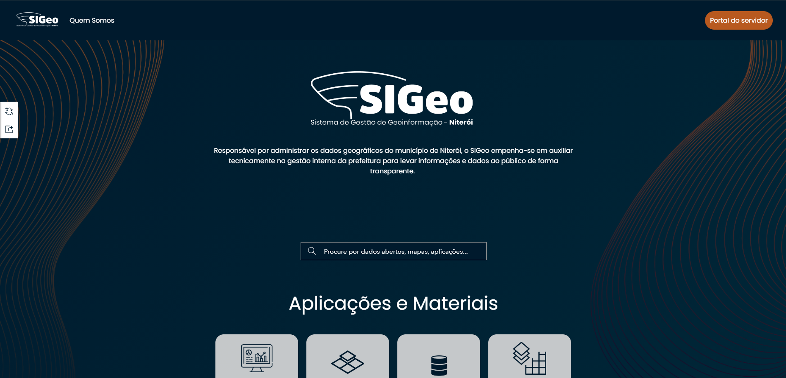

<a id="readme-top">En | Pt-br</a>

 

<h1 align="center">Repository with SIGeo HUB components | Repositório com os componentes do HUB do SIGeo</h1>

  

    This repository was created to organize and share the codes of custom components used to build the Niterói SIGeo HUB.
  

  

    Esse repositório tem como objetivo organizar e compartilhar os códigos dos componentes personalizados usados na estruturação do HUB do SIGeo de Niterói.
  

  
<a href="https://github.com/SIGeo-Niteroi/scripts/issues">Report Bug</a>

  
Table of contents | Súmario

  <ol>
    <li>
      <a href="#about-the-repository--sobre-o-repositório">About The Repository | Sobre O Repositório</a>
      <ul>
        <li><a href="#built-with--desenvolvido-com">Built With | Desenvolvido Com</a></li>
      </ul>
    </li>
    <li>
      <a href="#components--componentes">Components | Componentes</a>
      <ul>
        <li><a href="#cabecalho">cabeçalho</a></li>
        <li><a href="#rodape">rodapé</a></li>
      </ul>
    </li>
    <li><a href="#usage--uso">Usage | Uso</a></li>
    <li><a href="#contributing--contribuindo">Contributing | Contribuindo</a></li>
    <li><a href="#contact--contato">Contact | Contato</a></li>
    <li><a href="#contributors--contribuidores">Contributors | Contribuidores</a></li>
  </ol>

<h2 id="about-the-repository--sobre-o-repositório">About The Repository | Sobre O Repositório</h2>

Welcome! This is a repository created by Data Office from Niterói city hall to organize and share the codes of custom components used to build the Niterói SIGeo HUB. Here you can find the codes of our custom components writed in HTML and CSS.

Bem vindo(a)! Esse é um repositório criado pelo Escritório de Dados da prefeitura de Niterói para organizar e compartilhar os códigos dos componentes personalizados usados na estruturação do HUB do SIGeo de Niterói. Aqui você pode encontrar os códigos dos nossos componentes feitos em HTML e CSS.

(<a href="#readme-top">back to top</a>)

<h2 id="built-with--desenvolvido-com">Built With | Desenvolvido Com</h2>

[![HTML]][html-url] [![CSS]][css-url] [![Arcgis-hub]][arcgis-hub-url]

(<a href="#readme-top">back to top</a>)

<h2 id="components--componentes">Components | Componentes</h2>

  
📁 cabeçalho

  
HTML and CSS files for the header used in the SIGeo HUB

  
Arquivos em HTML e CSS do cabeçalho usado no HUB do SIGeo

  
📁 rodapé

  
HTML and CSS files for the footer used in the SIGeo HUB

  
Arquivos em HTML e CSS do rodapé usado no HUB do SIGeo

  

(<a href="#readme-top">back to top</a>)

<!-- GETTING STARTED -->

<h2 id="usage--uso">Usage | Uso</h2>

Will be listed here the code's demo | Será inserido aqui uma demo do uso dos códigos

(<a href="#readme-top">back to top</a>)

<h2 id="contributing--contribuindo">🤝 Contributing | Contribuindo</h2>

Contributions are **greatly appreciated**! | Contribuições são **sempre bem vindas**!

If you have a suggestion that would make this project better, please fork the repo and create a pull request. You can also open an issue with the tag "enhancement".

Se você possuir alguma sugestão que possa tornar esse projeto melhor, por favor fork esse repositório e crie um pull request. Você pode também abrir um issue com a tag "enhancement".

1. Fork the Project | Fork o Projeto
2. Create your Feature Branch | Crie sua  Feature Branch (`git checkout -b feature/AmazingFeature`)
3. Commit your Changes | Commit suas mudanças (`git commit -m 'Add some AmazingFeature'`)
4. Push to the Branch | Push para sua Branch (`git push origin feature/AmazingFeature`)
5. Open a Pull Request | Abra um Pull Request

Thanks! Obrigado! 😄

(<a href="#readme-top">back to top</a>)

<h2 id="contact--contato">Contact | Contato</h2>

Sistema de Gestão de Geoinformação - [Portal SIGeo](https://www.sigeo.niteroi.rj.gov.br/) - atendimento@sigeo.niteroi.rj.gov.br

(<a href="#readme-top">back to top</a>)

<h2 id="contributors--contribuidores">Contributors | Contribuidores</h2>

Made with [contrib.rocks](https://contrib.rocks).

(<a href="#readme-top">back to top</a>)

[HTML]: https://img.shields.io/badge/html5-E34F26.svg?style=for-the-badge&logo=html5&logoColor=white
[Arcgis-hub]: https://img.shields.io/badge/ArcGIS-hub-2C7AC3.svg?style=for-the-badge&logo=ArcGIS&logoColor=white
[CSS]: https://img.shields.io/badge/CSS3-1572B6.svg?style=for-the-badge&logo=css3&logoColor=white
[html-url]: https://developer.mozilla.org/en-US/docs/Web/HTML
[css-url]: https://developer.mozilla.org/en-US/docs/Web/CSS
[arcgis-hub-url]: https://hub.arcgis.com/
